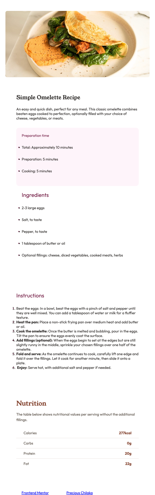

# Frontend Mentor - Recipe page solution

This is a solution to the [Recipe page challenge on Frontend Mentor](https://www.frontendmentor.io/challenges/recipe-page-KiTsR8QQKm). Frontend Mentor challenges help you improve your coding skills by building realistic projects. 

## Table of contents

- [Overview](#overview)
  - [The challenge](#the-challenge)
  - [Screenshot](#screenshot)
  - [Links](#links)
- [My process](#my-process)
  - [Built with](#built-with)
  - [What I learned](#what-i-learned)
  - [Continued development](#continued-development)
- [Author](#author)
- [Acknowledgments](#acknowledgments)

## Overview

this is a recipe page challenge from frontend mentor, using html and css to create a recipe page. It is a responsive recipe page that can be used on any device. 

### Screenshot

### Links

- Solution URL: [Add solution URL here](https://github.com/PreciousAma/recipe-page)
- Live Site URL: [Add live site URL here](https://preciousama.github.io/recipe-page/)

## My process
In the process of building this recipe page i made use of semantic html5 markup, css custom properties, flexbox, css grid, and a mobile-first workflow. I also made use of css variables to store the colors and fonts used in the design. I also made use of css grid to create the layout of the page. I also made use of flexbox to create the layout of the page. I went further to make the page responsive and accessible.

### Built with

- Semantic HTML5 markup
- CSS custom properties
- Flexbox
- CSS Grid
- Mobile-first workflow

### What I learned
In the process of building this recipe page i learned how to use semantic html5 markup, css custom properties, flexbox, css grid, and a mobile-first workflow. I also learned how to make the page responsive and accessible.

### Continued development
i will continue to work on my css grid and flexbox skills, i will also continue to work on my mobile-first workflow. I will also continue to work on my css variables to store the colors and fonts used in the design. I will also continue to work on my css grid and flexbox to create the layout of the page and continue to work on making the page responsive and accessible.

## Author

- Website - [Precious Chilaka](https://www.your-site.com)
- Frontend Mentor - [@PreciousAma](https://www.frontendmentor.io/profile/PreciousAma)
- Twitter - [@ama_chi](https://x.com/_ama_chi?s=11&t=NkDC6hglpeEjxhvaHK0SKg)

## Acknowledgments

I got the design inspiration from frontend mentor and i used the design to create the recipe page. I also made use of the assets provided by frontend mentor to create the recipe page. I also made use of the style guide provided by frontend mentor to create the recipe page. I am grateful to frontend mentor for providing this challenge and the resources to complete it. i am also grateful to my friends who encouraged me to complete this challenge and antigravity for helping me with the code.

